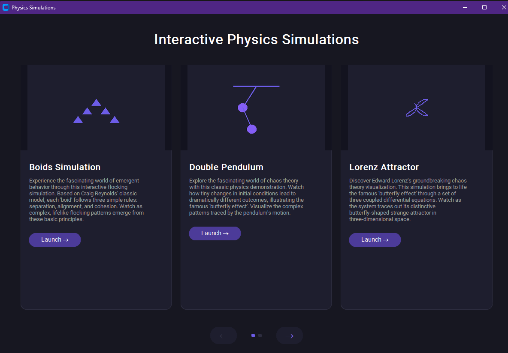

# Interactive Physics Simulations

A collection of interactive physics simulations implemented in Python, featuring a modern, user-friendly interface. This project brings to life various fascinating physics concepts through visual, interactive demonstrations.



## Features

### 1. Boids Simulation
Experience emergent flocking behavior through an interactive simulation based on Craig Reynolds' classic model. Each 'boid' follows three simple rules:
- Separation: Avoid crowding neighbors
- Alignment: Steer towards average heading of neighbors
- Cohesion: Steer towards average position of neighbors

### 2. Double Pendulum
Explore chaos theory with this classical physics demonstration. The double pendulum system illustrates:
- Sensitive dependence on initial conditions
- The famous "butterfly effect"
- Complex pattern generation from simple rules

### 3. Lorenz Attractor
Visualize Edward Lorenz's groundbreaking chaos theory demonstration:
- Watch the system trace its distinctive butterfly-shaped strange attractor
- Observe how small changes lead to dramatically different trajectories
- Interact with the 3D visualization in real-time

### 4. Wave Form Simulator
Study wave physics through an interactive wave propagation and interference simulation:
- Create and manipulate multiple wave sources
- Observe constructive and destructive interference
- Experiment with frequency, amplitude, and wavelength in real-time

## Installation

1. Clone the repository:
```bash
git clone [https://github.com/marcelloadonato/EducationalSimulations/]
cd physics-simulations
```

2. Create a virtual environment:
```bash
python -m venv venv
```

3. Activate the virtual environment:
- Windows:
```bash
.\venv\Scripts\activate
```
- Unix/MacOS:
```bash
source venv/bin/activate
```

4. Install dependencies:
```bash
pip install -r requirements.txt
```

## Usage

Run the main menu to access all simulations:
```bash
python src/main_menu.py
```

Each simulation can also be run independently:
- Boids: `python src/boids-simulation.py`
- Double Pendulum: `python src/double-pendulum.py`
- Lorenz Attractor: `python src/lorenz-attractor.py`
- Wave Form: `python src/wave-form-simulator.py`

## Project Structure
```
.
├── README.md
├── requirements.txt
├── docs/
│   └── menu_screenshot.png
└── src/
    ├── __init__.py
    ├── main_menu.py
    ├── boids-simulation.py
    ├── double-pendulum.py
    ├── lorenz-attractor.py
    ├── wave-form-simulator.py
    └── assets/
        └── icons/
```

## Development

- Code formatting: `black src/`
- Linting: `flake8 src/`
- Running tests: `pytest`

## Requirements

- Python 3.8+
- Required packages are listed in `requirements.txt`

## Contributing

Contributions are welcome! Please feel free to submit a Pull Request.

## License

This project is licensed under the MIT License - see the [LICENSE](LICENSE) file for details.

## Acknowledgments

- Craig Reynolds for the original Boids algorithm
- Edward Lorenz for the Lorenz attractor system
- The CustomTkinter project for the modern UI components 
